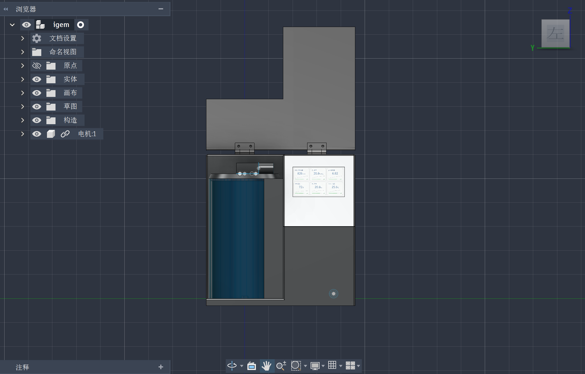
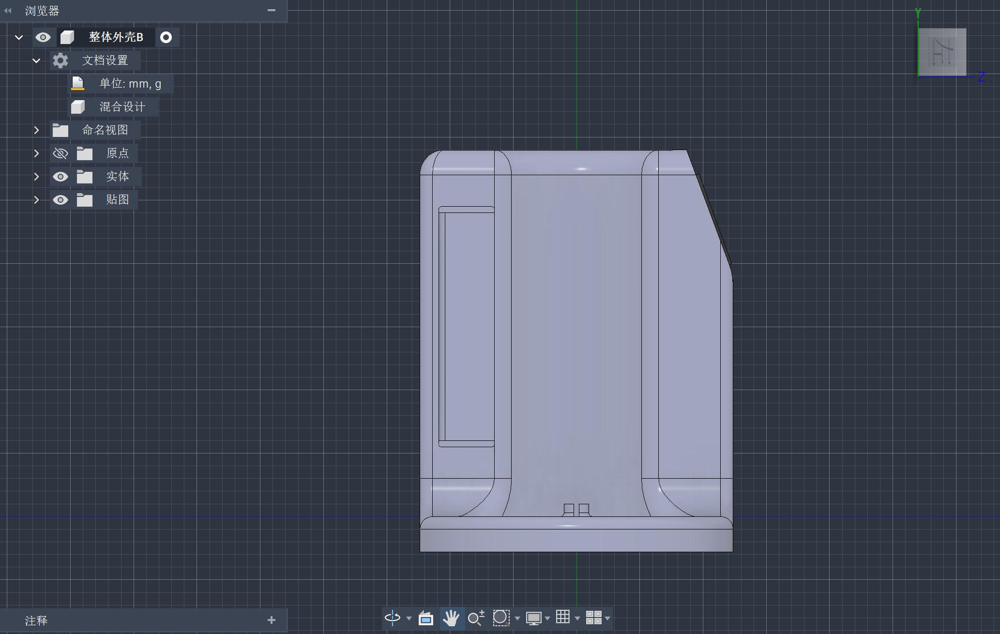
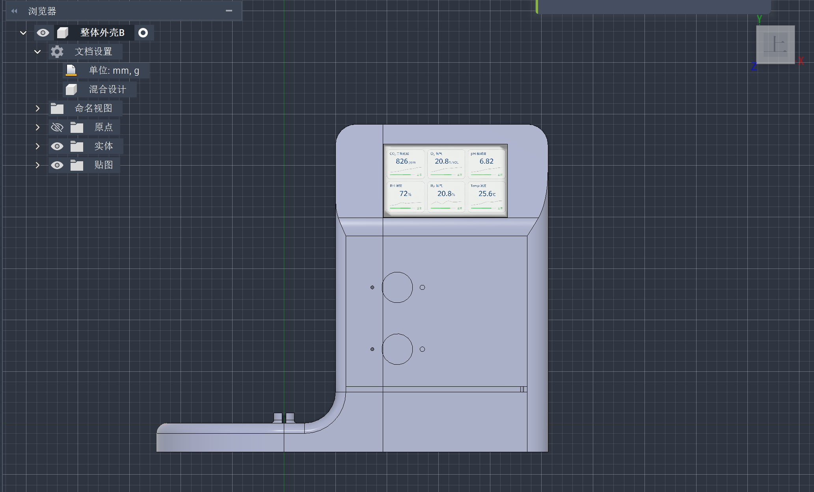

# BrewXOS Hardware Shell - Iteration History

> This document records the design iteration of the BrewXOS hardware system.  
> Iteration window: 2026-08-03 -> 2026-08-04 (16 hours).  
> Design tool: Autodesk Fusion 360 (exported to STEP AP214).

---

## Version 1 (2026-08-03, 242 KB)

### Design Goals
- **Prioritize internal functionality** - get the fermentation vessel, sensors, and control system working end-to-end
- **Rapid validation** - able to run a fermentation experiment quickly
- **Easy debugging** - open structure for quick modifications

### Key Design Features
- Glass fermentation vessel (transparent for direct observation of the fermentation process)
- 6-parameter LCD real-time display (CO2 / O2 / pH / cumulative / H2 / temperature)
- Single sensor / agitator rod on the top
- Flat base
- Basic L-shaped overall structure

### Limitations (drove the V2 redesign)
1. **Open top** -> not suitable for industrial-grade SIP / hygiene requirements
2. **Exposed vessel** -> looks like bench-top lab equipment, not a product
3. **Single interface** -> only one rod on top, poor extensibility
4. **Flat base** -> center of gravity and vibration not optimized
5. **Modularization unclear** -> vessel, control, and display mixed together

### Screenshots
- 
- 
- 

---

## Version 2 (2026-08-04, 458 KB, +89% detail density)

### Drivers for the Redesign
Based on the V1 trial-build feedback and the iGEM judging criteria:
- Need a **deliverable, product-grade appearance** (not a bench-top rig)
- Need **full sealing** (contamination prevention / SIP-ready)
- Need **multi-interface extensibility** (temperature / pH / DO / sampling / feed)
- Need **clear modularization** (for maintenance and future upgrades)

### Key Improvements
1. **Full sealed enclosure** - top cover added; sealing meets SIP requirements
2. **Vessel cladding** - lower half integrated into the shell; **appearance close to a commercial prototype**
3. **Beveled base** - improved center of gravity, vibration damping, more modern look
4. **Left-side L-extension** - multi-interface layout (sampling / pH / DO / feed)
5. **Modular zoning** - circular fermentation zone (biological reaction area) + rectangular control zone (electronics area) **physically separated**
6. **All V1 functionality preserved** - 6-parameter LCD display, transparent glass vessel, overall control logic

### Screenshots
- 
- 
- 

---

## Design Principles (V1 -> V2)

### 1. Function First, Then Productization (Two-Stage Focus)
- **V1: "Make it work"** - internal functionality complete
- **V2: "Package the internals into a deliverable"** - appearance, manufacturability, serviceability

### 2. Modularization (Strengthened in V2)
- **Fermentation zone** = glass vessel + sensors + heater + agitator = one physical module
- **Control zone** = DFRduino Mega2560 + LCD + interfaces = another physical module
- **Benefit**: fault isolation, easy maintenance, future upgrade path (V3 adds WiFi / automation)

### 3. Data-Driven Decisions
- Every improvement point is grounded in a concrete issue encountered during V1 use
- Not "for the sake of looking nicer" but "for the sake of real engineering needs"

### 4. Cross-Disciplinary Integration
- Mechanical shell (mechanical design / Fusion 360)
- Control system (DFRduino Mega2560 + LCD)
- Sensor interfaces (pH / DO / temperature / sampling / feed)
- Industrial design (UX / manufacturability / hygiene)

---

## August Iteration Roadmap

- **V3 Plan (post-September 2026 school start)**:
  - Integrate top-mounted agitator motor (reusing the V1 single-rod location)
  - Reserve DO sensor port
  - Integrate CIP (clean-in-place) piping
  - Web dashboard (data upload via ESP8266)

---

## CAD Files
- **V1**: `igem.step` (242 KB, exported from Autodesk Fusion 360)
- **V2**: `整体外壳B.STEP` (458 KB, exported from Autodesk Fusion 360)

## Authorship
- **Hardware design**: Thomas ZHAO (赵昶瑞)
- **Advisor**: DFRduino Mega2560 main controller + control system design
- **Project**: BrewXOS - iGEM 2026 - Shanghai Hongwen School Pudong
