# Pre-iGEM Training - NMN Production (2026-01)

> **Project**: Nicotinamide mononucleotide (NMN) biosynthesis in *E. coli* BL21(DE3)
> **Duration**: 5 days (2026-01-14 to 2026-01-18)
> **Status**: Training complete; project later pivoted to **BrewXOS** (BSG -> XOS) for the official 2026 iGEM submission.

This page documents a 5-day end-to-end synthetic biology training the team ran in January 2026, before committing to the BrewXOS project. Although the project direction later changed, this training confirmed the team's **full wet-lab capability** (PCR, Gibson Assembly, transformation, gel verification, plasmid extraction) and gives the BrewXOS team a real wet-lab foundation.

---

## 1. Why We Did This

When the iGEM 2026 season started, our team explored two candidate projects:

1. **NMN biosynthesis** (nicotinamide mononucleotide, a NAD+ precursor with nutraceutical market value)
2. **BrewXOS** (BSG -> XOS, the project we ultimately committed to)

To de-risk the wet-lab pipeline, we ran a 5-day training on the NMN project. We learned the full PCR -> Gibson -> transformation -> verification cycle on a well-characterized system (NMN pathway enzymes, *E. coli* BL21(DE3) chassis), so that when we pivoted to BrewXOS we had **already validated the team's ability to execute** the full pipeline.

## 2. Project Target

Build a recombinant plasmid:

```
pUC57 - T7 promoter - RBS - NicA - RBS - NicB - RBS - NicC - rrnB
```

- **Vector backbone**: pUC57 (high-copy cloning vector)
- **Promoter**: T7 (inducible by IPTG)
- **Genes**: NicA, NicB, NicC (NMN biosynthesis enzymes)
- **Terminator**: rrnB

**Host**: *Escherichia coli* BL21(DE3) (T7 polymerase expression strain)

## 3. The 5-Day Pipeline

### Day 1 (2026-01-14) - PCR Amplification

**Goal**: Clone NicA, NicB, NicC, Vector, Lac1 inserts.

**Reagents** (per 50 µL reaction):
- 21 µL nuclease-free water
- 2 µL template DNA
- 1 µL forward primer (10 µM)
- 1 µL reverse primer (10 µM)
- 25 µL 2x Phanta Flash Master Mix (Vazyme)

**Thermal cycling**:
- Initial denaturation: 98 °C, 30 s
- 34 cycles of: 98 °C 10 s -> 60 °C 5 s -> 72 °C 40 s
- Final extension: 72 °C, 1 min

**Team organization**: 5 student groups, each amplifying one insert.

### Day 2 (2026-01-15) - Agarose Gel Electrophoresis + LB Preparation

**Goal**: Verify PCR product sizes; prepare sterile LB medium.

**Gel** (1% agarose, 25 mL TAE buffer + 2.5 µL Ultra Blue dye).

**Result**: Most PCR products showed clear bands at expected sizes; some samples had minor non-specific bands attributed to pipette contamination during primer addition.

**LB medium**: 10 g Tryptone + 5 g Yeast Extract + 5 g NaCl + 950 mL deionized water; autoclaved at 115 °C for 21 min.

### Day 3 (2026-01-16) - DNA Gel Extraction + Gibson Assembly

**Goal**: Purify PCR products; assemble into pUC57 backbone.

**Gel extraction kit** (silica-membrane spin column):
- 70% recovery yield, suitable for 150 bp - 10 kb fragments
- DNA eluted in 30 µL pre-warmed ddH2O

**Gibson Assembly** (one-step, three-enzyme reaction):
- T5 exonuclease (chew-back to create 3' overhangs)
- Phusion DNA polymerase (fill-in)
- Taq DNA ligase (seal nicks)
- 50 °C, 30-60 min

### Day 4 (2026-01-17) - Chemical Transformation

**Goal**: Introduce assembled plasmid into *E. coli* BL21(DE3).

**Protocol**:
1. Thaw competent cells on ice (5 min)
2. Add plasmid DNA, flick tube gently
3. Ice incubation: 25 min
4. Heat shock: 42 °C, 45 s
5. Ice recovery: 2 min
6. Add 700 µL antibiotic-free 2YT medium
7. Shake at 37 °C, 200 rpm, 60 min
8. Centrifuge 5,000 rpm, 1 min
9. Resuspend pellet in 100 µL, plate on selective agar
10. Inverted incubation at 37 °C overnight

**Result**: Precipitate formation observed (expected for transformed cells).

### Day 5 (2026-01-18) - Colony Verification by PCR + Plasmid Extraction

**Goal**: Confirm plasmid presence in transformants via colony PCR; extract plasmid for downstream use.

**Colony PCR**: Cells from two colonies re-suspended in 10 µL water, used as template with insert-specific primers.

**Plasmid extraction** (alkaline lysis):
- Resuspension (P1) -> Lysis (P2) -> Neutralization (N3)
- Spin column binding -> wash (PW) -> elute in 30 µL ddH2O
- Quantified by Nanodrop

## 4. What We Learned

This 5-day training taught us five things that BrewXOS relies on today:

1. **PCR optimization** - annealing temperature, primer design, and master-mix choice matter for product specificity
2. **Gel verification** - expected band sizes vs. non-specific bands (a skill we will reuse in every restriction digest and Gibson screen)
3. **Gibson Assembly** - 3-enzyme one-pot cloning is the standard for multi-fragment assembly (we will use this in the BrewXOS xylanase cassette)
4. **Transformation** - heat-shock timing and recovery medium are critical for *E. coli*; for *B. subtilis* (BrewXOS chassis) we will use a different protocol but the rigor transfers
5. **Plasmid extraction** - alkaline lysis + silica column works for both *E. coli* and *B. subtilis*; the skill transfers directly

## 5. Pivoting to BrewXOS

After the training, the team evaluated the NMN project against the BSG -> XOS project and decided to switch:

- NMN is dominated by large-scale chemical synthesis in China; market entry is hard for a high-school team
- BrewXOS has a stronger **circular-economy** narrative (BSG is a real waste problem) and a clearer hardware angle
- The training confirmed the wet-lab team could execute the full pipeline, so we were not blocked by skill gaps

The team committed to BrewXOS in May 2026; the 1-month delay between training and project start gave time for literature review, hardware design (V1, V2 enclosure), and modeling baseline (iJO1366 FBA, Michaelis-Menten kinetics).

## 6. Gel Images (Archive)

The following 16 gel images were captured during the training. They document the team's end-to-end wet-lab execution.

| Day | Image | Description |
|-----|-------|-------------|
| Day 2 | 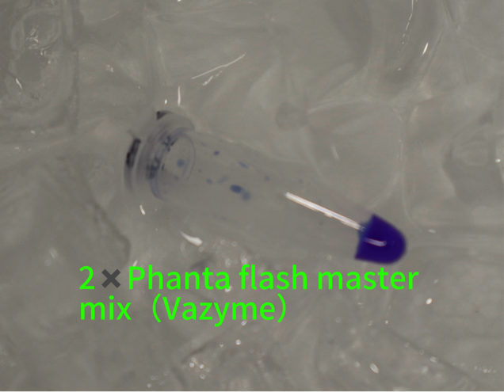 | PCR product verification (gel 1) |
| Day 2 | 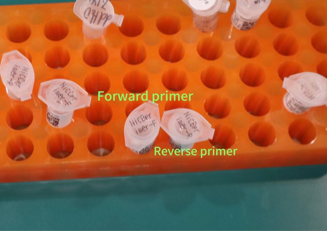 | PCR product verification (gel 2) |
| Day 2 | 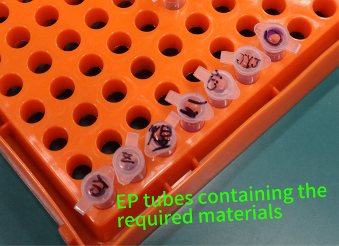 | PCR product verification (gel 3) |
| Day 2 | 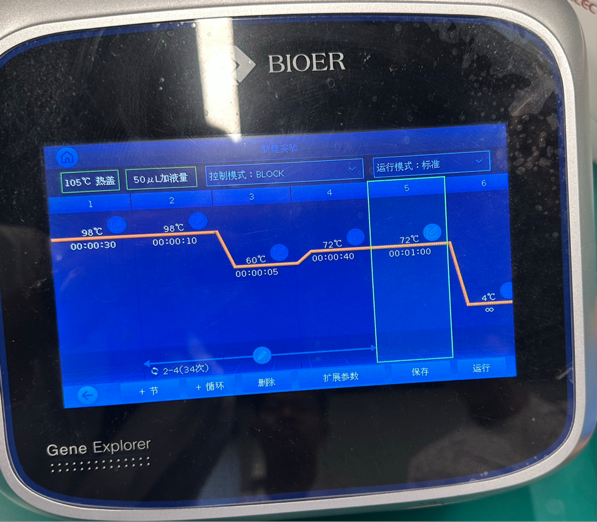 | PCR product verification (gel 4) |
| Day 2 | 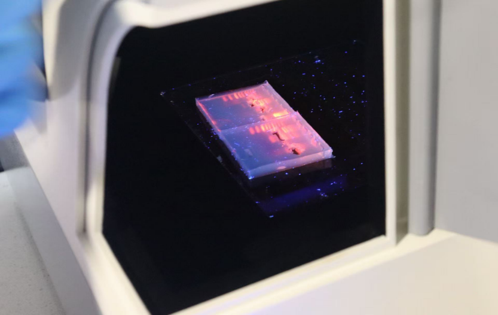 | PCR product verification (gel 5) |
| Day 2 | 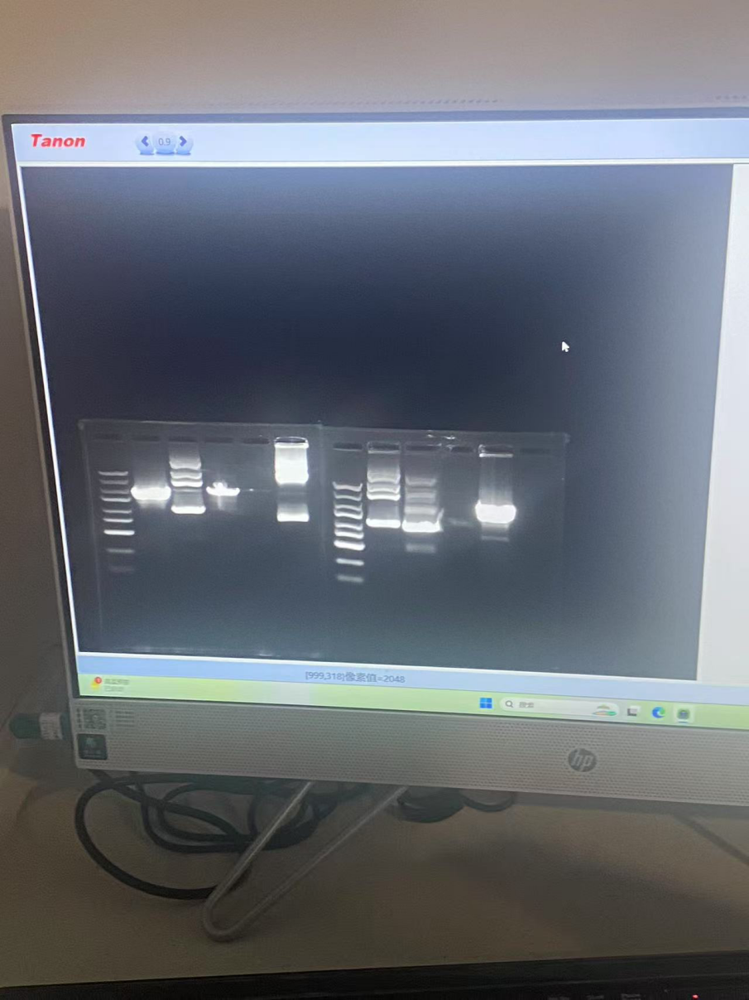 | PCR product verification (gel 6) |
| Day 3 | 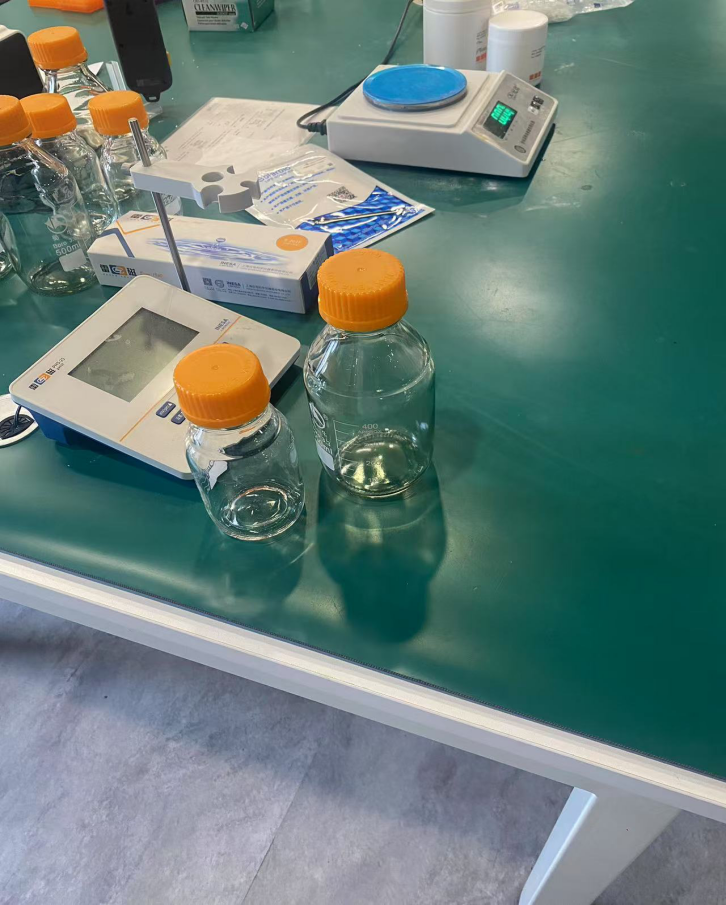 | Gel extraction / Gibson Assembly prep |
| Day 3 | 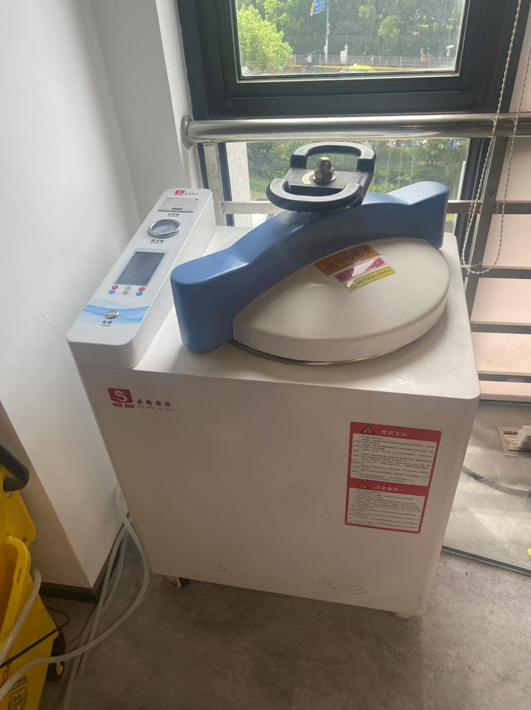 | Gel extraction / Gibson Assembly prep |
| Day 3 | 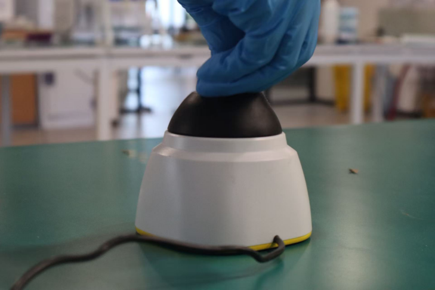 | Gel extraction / Gibson Assembly prep |
| Day 3 | 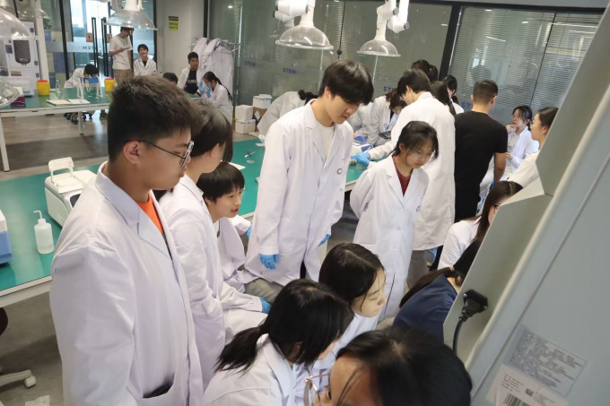 | Gel extraction / Gibson Assembly prep |
| Day 4 | 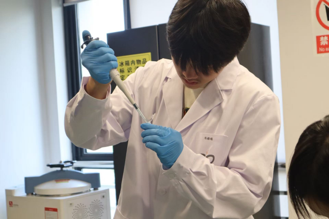 | Transformation screening |
| Day 4 | 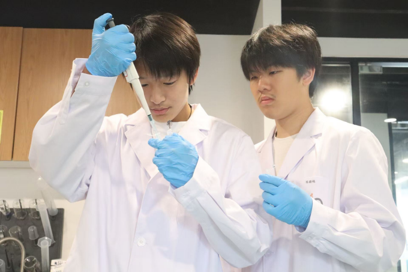 | Transformation screening |
| Day 4 | 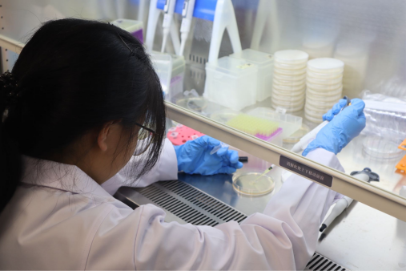 | Transformation screening |
| Day 4 | 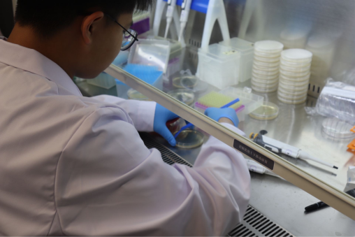 | Transformation screening |
| Day 5 | 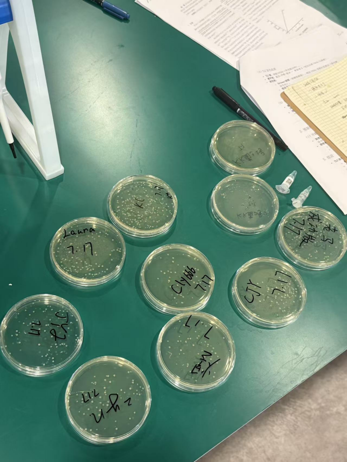 | Colony PCR + plasmid extraction |
| Day 5 | 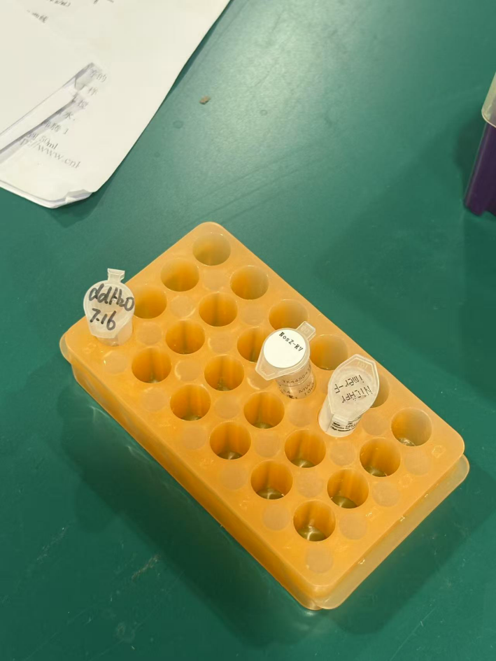 | Colony PCR + plasmid extraction |

## 7. Reuse in BrewXOS

The 5 skills from this training directly serve the BrewXOS wet-lab work planned for September 2026:

| Skill learned | BrewXOS use case |
|---------------|------------------|
| PCR amplification | Clone xylanase gene cassette |
| Gibson Assembly | Assemble 3-gene xylanase secretion construct (signal peptide + xylanase + secretion tag) |
| Gel verification | Screen every cloning step |
| Transformation | *B. subtilis* transformation (different protocol but same discipline) |
| Plasmid extraction | Verify constructs before fermentation |

## 8. Authorship

- **Wet-lab team**: 5 students, divided into 5 insert-cloning groups
- **Advisor**: iGEM faculty advisor
- **Original project lead**: NMN project, then BrewXOS
- **Date**: 2026-01-14 to 2026-01-18

## 9. Notes for iGEM Judges

- The NMN training was a **de-risking exercise**, not a delivered iGEM deliverable
- The wet-lab discipline carries forward into the BrewXOS submission
- The 16 gel images are archived for transparency; if the team switched projects, it is because of a **deliberate trade-off analysis**, not a failed experiment
- The 5-day timeline proves the team can execute a full synthetic biology pipeline in a school-lab setting
